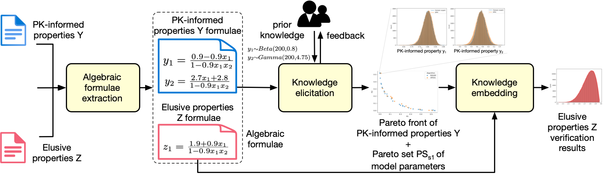

# EPIK

EPIK is the first work to elicit and embed prior knowledge in Bayesian learning for quantitative verification. 

EPIK leverages the expertise of domain experts in the form of prior knowledge about observable system-level properties. EPIK uses this knowledge to formulate a two-fold optimisation problem, enabling the extraction of Pareto-
optimal approximation sets, encoding distributions of unknown model transition parameters, and whose corresponding Pareto fronts yield system-level property distributions that closely approximate those provided by domain experts. Decision-makers can leverage the derived Pareto fronts during EPIK’s knowledge embedding step to quantify elusive system-level properties which are novel or rare, or those for which gathering information is risky or expensive.

## Getting Started

* Install the Python libraries in [requirements.txt](https://github.com/gerasimou/EPIK/blob/main/requirements.txt)
   
## Multi-objective EPIK

* Run [EPIK_Multi.py](https://github.com/gerasimou/EPIK/blob/main/EPIK_multi.py)

## Single-objective EPIK
* Run [EPIK_Single.py](https://github.com/gerasimou/EPIK/blob/main/EPIK_single.py)
